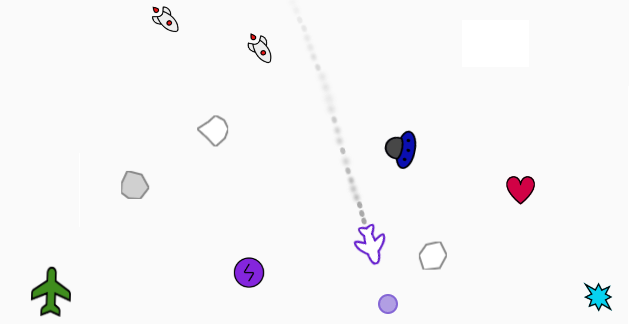
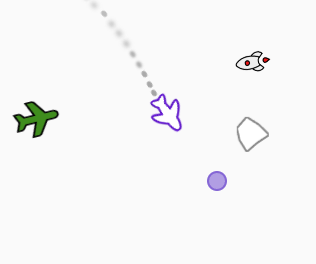
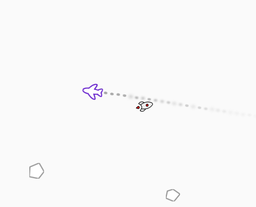

# Purple Wings (Mini Game) Guide

> This document provides a comprehensive guide to the game's core mechanics, rules, and gameplay. Below, you'll find detailed explanations of what happens in the game, available power-ups, and how the player can interact with the environment.

---

## Table of Contents

- [Purple Wings (Mini Game) Guide](#purple-wings-mini-game-guide)
  - [Table of Contents](#table-of-contents)
  - [Overview](#overview)
  - [Controls](#controls)
  - [Gameplay Mechanics](#gameplay-mechanics)
    - [Score and Progression](#score-and-progression)
    - [Level System and Rewards](#level-system-and-rewards)
    - [Enemies and Threats](#enemies-and-threats)
    - [Power-ups](#power-ups)
    - [Dodge Mechanic \& Missile Collision Bonus](#dodge-mechanic--missile-collision-bonus)
  - [Game Over and Restart](#game-over-and-restart)
  - [Technical Details and Running the Game](#technical-details-and-running-the-game)
  - [Conclusion](#conclusion)

---

## Overview

In the game, you control an **airplane** using mouse movements. Your goal is to survive against enemy planes, missile attacks, and meteors while increasing your score, which rises automatically over time. The longer you survive, the more rewards you earn, such as extra lives, power-ups, and shields.

---

## Controls

- **Mouse Movement:**  
  Your airplane follows the position of the mouse. Move your mouse to steer the plane.

- **Mouse (Left) Click:**  
  If available, clicking activates a **directional purple wave** using a **purple orb**.

- **Space Key:**  
  If you have a **flare**, press the **Space** key to launch it and destroy missiles behind you.

---

## Gameplay Mechanics

### Score and Progression

- **Score Increase:**  
  The score increases automatically as the game progresses. Your score represents how long you've survived and how well you avoid threats.

- **Purple Orb Progression:**  
  Every set score milestone (e.g., every 100 points), progress toward earning a **purple orb** is shown in a progress bar. The calculation uses `score` and `nextOrbScore` variables.  
  > For example, in `mini_game.js`, the score updates every second, and the next orb threshold is calculated accordingly.

### Level System and Rewards

- **Level Ups:**  
  As the score increases, the player levels up. The level updates at certain score thresholds:
  - **Level 2:** Score of 250+
  - **Level 3:** Score of 500+
  - **Level 4:** Score of 750+
  - **Level 5 (MAX):** Score of 1000+

- **Rewards:**  
  Players receive various rewards when leveling up:
  - **Heart (Life):** Adds up to a maximum of 3 lives.
  - **Purple Orb:** Earned every set score increase (e.g., every 100 points). The maximum number of purple orbs is 3.
  - **Flare:** Given when all other rewards are at maximum.
  - **Shield:** If all rewards are at their max or under special conditions, a temporary shield is granted.

  > The reward mechanism is managed by the `doLevelUpReward` function in `logic.js`.

### Enemies and Threats

- **Enemy Planes:**  
  Randomly spawned enemy planes enter the screen from the edges. At higher levels, they can also fire missiles.

- **Missiles:**  
  Spawned from enemy planes or randomly, these homing missiles lock onto the player. If a missile hits the plane without an active shield, the player takes damage or is destroyed.

- **Meteors:**  
  Meteors of random size and shape enter from the screen edges. They create an explosion effect upon collision.

  > Enemy spawning and movement logic are defined in `spawn.js` and `entities.js`.

### Power-ups

- **Shield:**  
  Grants a temporary 10-second shield. While active, collisions trigger an explosion effect but do not harm the airplane.

- **Heart (Life):**  
  Adds an extra life, helping players survive longer.

- **Flare:**  
  When collected, flares can be fired using the Space key to clear hazards from the screen.

  > Power-ups are collected using the collision detection mechanism and managed in `logic.js` and `mini_game.js`.

### Dodge Mechanic & Missile Collision Bonus

This game includes an advanced **dodge mechanic**, which allows skilled players to evade missiles at the last second for bonus points. Additionally, missiles can be redirected into enemy planes for extra rewards.

- **Dodge Bonus:**  
  - If you make a sharp maneuver **just before a missile reaches your plane**, the missile is dodged.  
  - Successfully dodging a missile grants **+10 points**.

  _Example: If a missile is very close and you change direction quickly, it will miss and you earn a dodge bonus._

- **Missile Collision Bonus:**  
  - If a **missile hits an enemy plane**, you earn **+5 points**.
  - This can be achieved by luring missiles towards enemy planes before dodging them.

  _Example: If an enemy plane appears and you maneuver to make a missile hit it instead of you, you receive an extra bonus._

- **Standard Score Rate:**  
  - Aside from these bonuses, the normal score increases by **+1 per second**.

These mechanics add a layer of strategy, encouraging players to take calculated risks instead of just avoiding enemies.

## Game Over and Restart

- **Collisions and Life Loss:**  
  If your airplane collides with a hazardous object and has no active shield, you lose a life. When all lives are lost, the game ends.

- **Respawn Mechanism:**  
  If you still have lives remaining, the plane respawns after a short delay.

- **Game Over Screen:**  
  At the end of the game, a final score and playtime summary appear on an overlay screen, providing options to restart or exit.

- **Restarting the Game:**  
  Clicking the "Play Again" button resets the game, clearing the score, level, power-ups, and all spawned objects.

  > These mechanics are handled in `mini_game.js` and `logic.js`.

---

## Technical Details and Running the Game

- **Technology Stack:**  
  The game is built using HTML, CSS, and JavaScript.

- **File Structure:**  
  - **plane.js:** Manages the airplane's movement, rotation, and flame effects.
  - **entities.js:** Defines enemy planes, missiles, and power-up objects.
  - **logic.js:** Manages in-game score, levels, collision detection, and rewards.
  - **mini_game.js:** Handles game start, countdown, UI updates, and overall game flow.
  - **spawn.js:** Controls spawn timings for meteors, enemy planes, missiles, and power-ups.
  - **flame.js:** Creates flame effects from the airplane's exhaust.
  - **meteor.js:** Defines meteor objects and their movement.

- **Running the Game:**  
  Simply open the corresponding HTML file in a web browser to play. Ensure that all assets and files are in the correct directory.

---

## Conclusion

This mini-game offers an exciting challenge with dynamic spawn mechanics, interactive power-ups, and increasing difficulty levels. Use your reflexes and strategy to survive longer, achieve high scores, and unlock rewards.

Have fun and good luck!